### KITTI Dataset
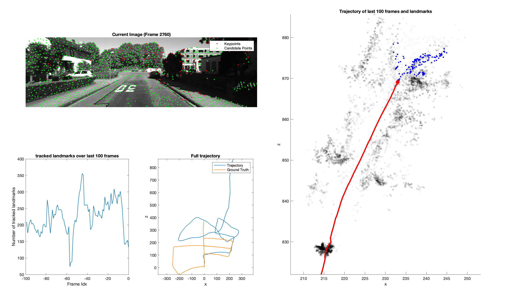
caption: result of KITTI dataset

In the KITTI dataset, the pipeline manages to achieve the local consistency. The estimation of the movement is in general correct. As there are multiple turns in the video and the pose estimation doesn't have enough robustness, the estimated trajectory is screwed from the ground truth. This drifting performance is due to the working principle of monocular visual odometry currently not solvable. During the test on this dataset, it was observed that the estimation of movement scale is largely reduced after each turn, which can be seen in the comparison of two figures below.
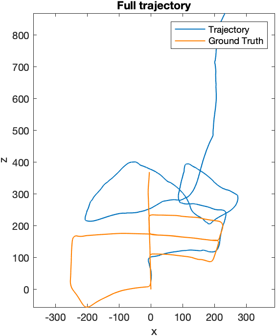
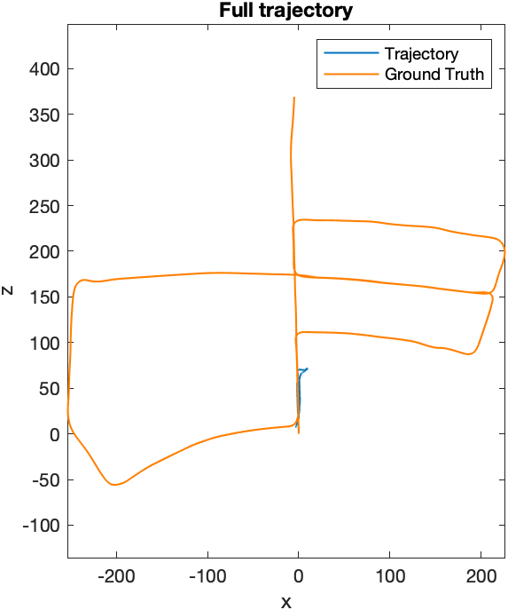
caption: trajectory with (left) and without ContInitialization() (right)

To resolve this problem, the ContInitialization() was purposed to bootstrap again during the continuous operation. When the number of keypoint pairs for pose estimation is not enough, the bootstrap will be executed to achieve more corresponding keypoints to increase the robutness of estimation. However this method also has disadvantage, which will be discussed in the next dataset.

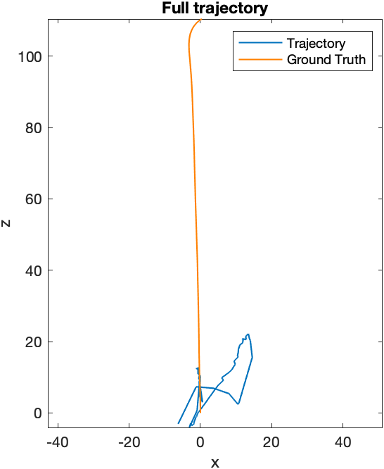
caption: p3p (left) and DLT (right)

Both p3p and DLT methods are implemented in the pipeline. In multiple tests, p3p is prooven to be more robust in pose estimation. Another comparison has to be mentioned here is the deletion of far away points. The landmarks exceeding the threshold will be deleted. If the pose estimation takes the far away points into account, the scale of linear movement is more likely to be overestimated, which is less robust. Thus, the far away points are taken away from the data.

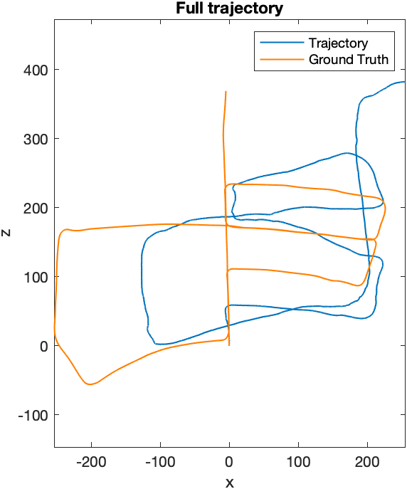

caption: with (left) and without (right) far away points

### Malaga Dataset
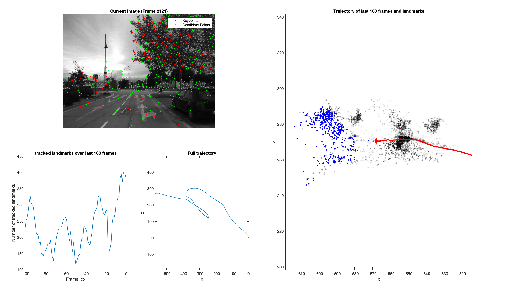
caption: result of Malaga dataset

The estimated trajectory in Malaga dataset is also locally consistent. When the pipeline bootstrapes, the tracked landmarks are discarded, which can be seen in the huge drop in the tracked landmark graph. And this is the cause of the samll fluctuation in the estimated trajectory.

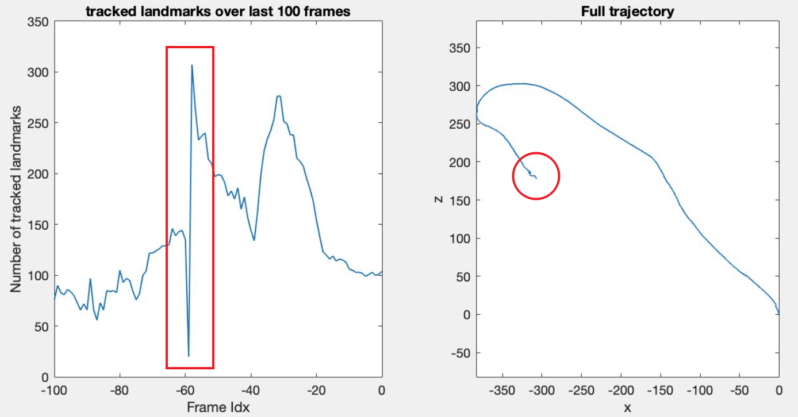
caption: tracked landmarks drop

Throughout the development of the pipeline, it is noticed that, the non-maximum suppresion of Harris Corner Detector has influece on the smoothness of the trajectory. The bigger the none maximum suppresion radius, the less features will be detected. If too many features are used for pose estimation, the trajectory tends to be twisted. Accordingly the whole trajectory is changed. However, if the number of features is too small, the estimation is also unstable, which leads to ContInitialization(). The radius of the non-maximum suppression is thus an important parameter to tune. For the same reason, Harris Detector was selected instead of SURF Detector. SURF Detector can provide usually less featrues than Harris, which is critical for the rotation estimation when truning.

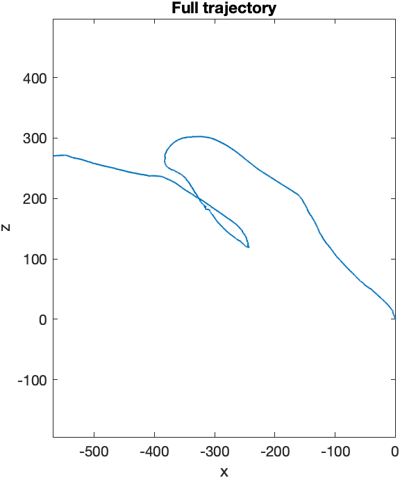
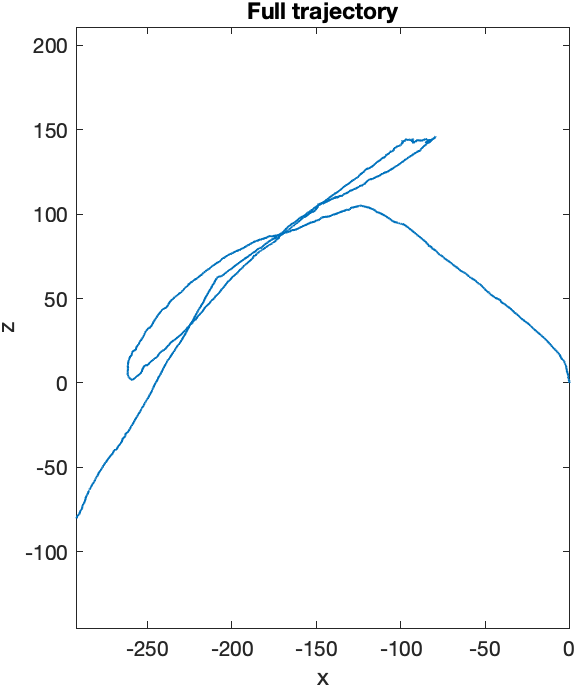
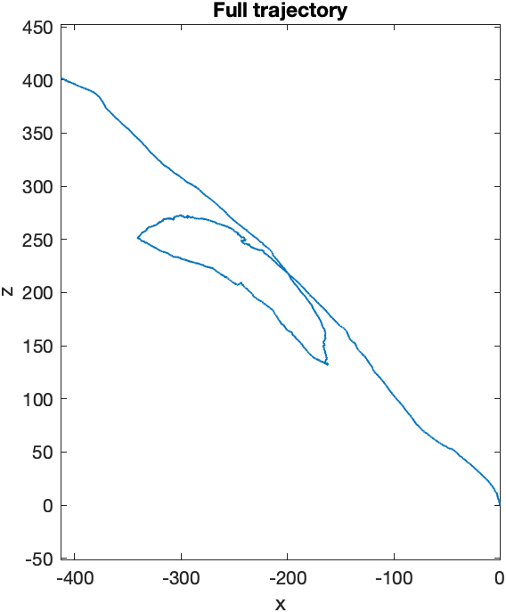
caption: big radius (left) and small radius (middle) of non-maximum suppression, with SURF Detector (right)

### Parking Dataset
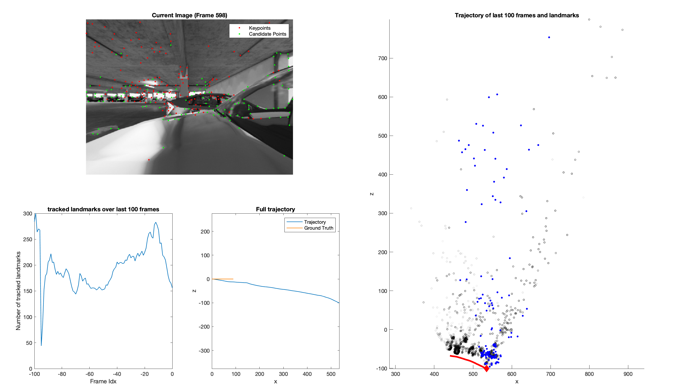
caption: result of Parking dataset
Parking dataset is generated in a simulation environment and has less difficulty. However, the scale of the movement estimation is largely deviated from the ground truth. The possible reasons could be:
- the baseline between two frames is too small (15 cm)
- the features extracted are either nearby the camera or far away (a set of features evenly distributed in depth might contribute to a good estimation)